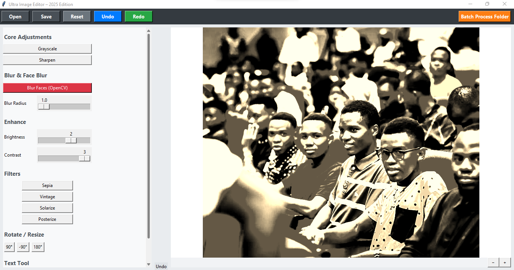
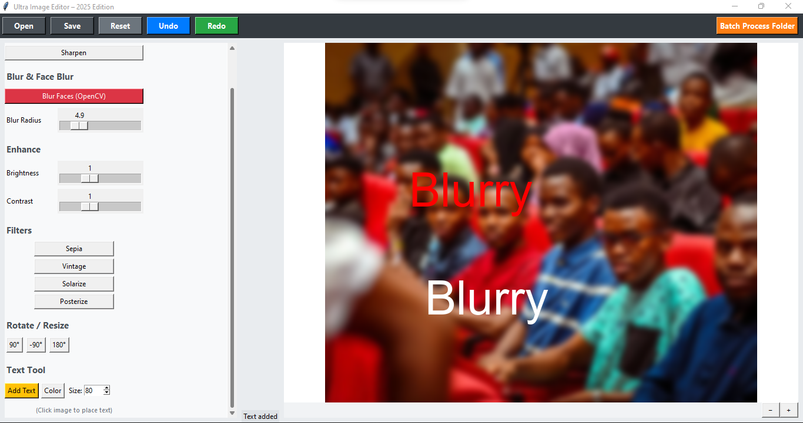
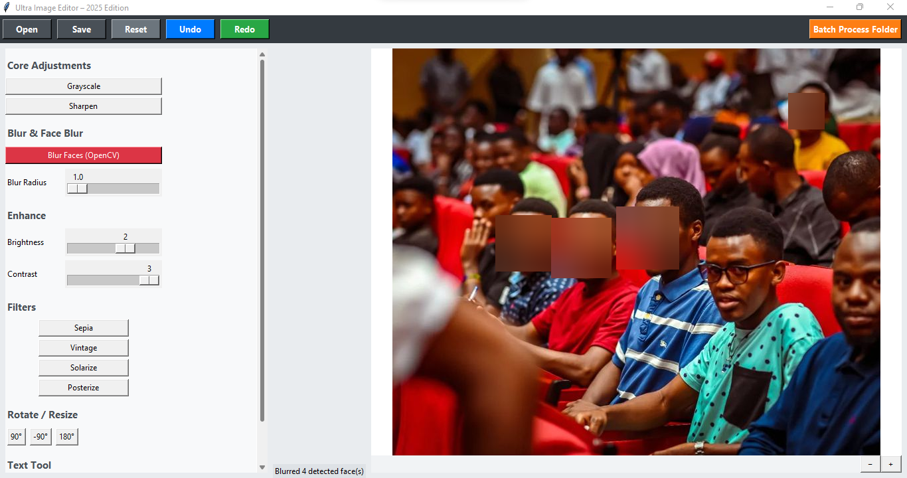

```markdown
[](https://www.python.org/)
[](https://opensource.org/licenses/MIT)
```
# Ultra Image Editor

A simple yet powerful desktop image editor built with **Python**, **Tkinter**, **Pillow (PIL)** and **OpenCV**.

https://github.com/TekFed/ultra_image_editor

  

## Features

- **Basic adjustments**
  - Grayscale conversion
  - Sharpen filter
  - Gaussian blur (with live radius slider)

- **Face detection & blur** (using OpenCV Haar cascade)
  - Automatically detects frontal faces and applies strong blur

- **Color & lighting enhancements**
  - Brightness & contrast sliders (live preview)

- **Artistic filters**
  - Sepia
  - Vintage look
  - Solarize
  - Posterize

- **Rotation**
  - 90°, -90°, 180° quick buttons
  - (Custom angle support can be easily added)

- **Text tool**
  - Click on image to place text
  - Choose color via color picker
  - Adjustable font size (12–120 pt)
  - Uses system fonts (falls back to default)

- **Zoom**
  - Zoom in / out buttons (canvas scaling)

- **Undo / Redo** (limited history – 12 steps)

- **Batch processing**
  - Apply simple processing (currently example blur) to entire folder

- **Save** with quality options (JPEG/PNG)

## Screenshots

(Add 2–4 screenshots here – preferably showing different features)

| Main interface | Text tool in action | Face blur result |
|----------------|---------------------|------------------|
|  |  |  |

## Requirements

```bash
pip install pillow opencv-python


- Python 3.8+
- Tkinter (usually comes with Python)
- Pillow (PIL fork)
- OpenCV (for face detection)
```

## Installation & Running

1. Clone the repository

```bash
git clone https://github.com/yourusername/ultra-image-editor.git
cd ultra-image-editor
```

2. Install dependencies

```bash
pip install -r requirements.txt
# or directly:
pip install pillow opencv-python
```

3. Run the application

```bash
python ultra_enhanced_image_editor.py
```

## Current Limitations / Known Issues

- No crop tool yet
- Batch processing currently applies only a fixed Gaussian blur (easy to extend)
- Text uses Arial or default font – no full font selector
- Face detection uses basic Haar cascade (not as accurate as modern models)
- No layers / non-destructive editing
- Undo history is limited and memory-intensive for large images

## Planned / Possible Future Features

- Crop & resize tools
- Freehand drawing / annotations
- More filters (hue/saturation, curves, vintage LUTs)
- Better batch processing (save last applied operation)
- Keyboard shortcuts
- Drag & drop image opening
- Export presets / styles

## Contributing

Pull requests are welcome!

Especially interested in:

- Adding missing basic editing tools (crop, resize)
- Improving batch processing
- Adding more modern filters
- Performance optimizations for large images

## License

MIT License

Feel free to use, modify, distribute.

Made with ❤️ in Python for quick local image editing experiments.

Happy editing!
